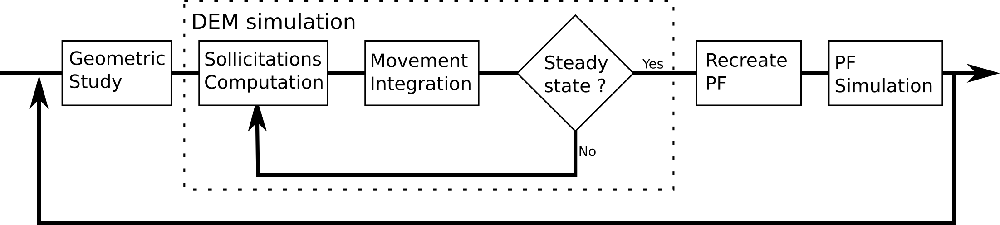

# PFDEM_AC
Phase-Field Discrete Element Modelisation applied to granular material.

## Simulation presentation
This simulation is about a 2D test under oedometrical conditions with an acid injection.
The chain force and the k0 (= &sigma;1/&sigma;2) evolves with the material dissolution.

## Technical description
A back and forth is done between phase-field (PF) simulation and discrete element modelisation (DEM). The following scheme illustrated the algorithm.

 PF approach is computed with [MOOSE](https://github.com/idaholab/moose) and DEM is computed with an own script based on python 3.9.6. The launch of this project is done by executing the python script <i>main.py</i>.

### PF
The goal of the PF step is to compute the shape of the grains as it evolves with the dissolution.
An Allen-Cahn formulation is used.

### DEM
The goal of the DEM step is to compute a steady-state configuration. Grains are assumed as polygonal. The shape is computed from an interpolation of the PF variable. At the end of the step, interactions (grain-grain and grain-wall) are computed to highlight the evolution of the chain force and k0.

## What is next ?
Some next releases are presented here.

- optimize DEM (rework on the nearest vertices detection)
- add rolling resistance
- increase the user experience (add some files with all parameters to define a simulation, use dictionnary to transmit data, homogenize names, correct english)
- create a database of initial condition
- create AI to select algorithm parameters (as neighborhood update frequency, time step, stop criteria, etc...)
- change the initial shape of grain
- add some quick tests to check the script
