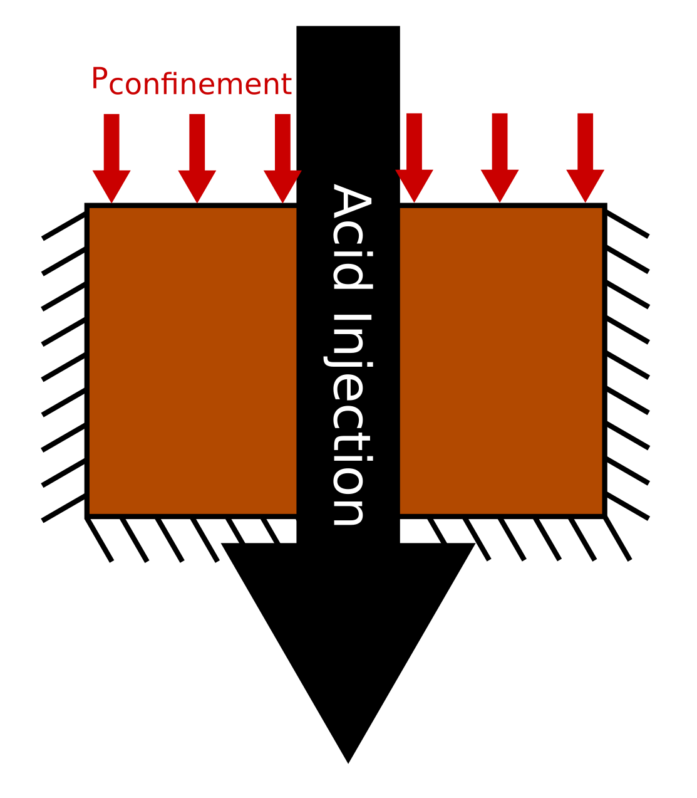
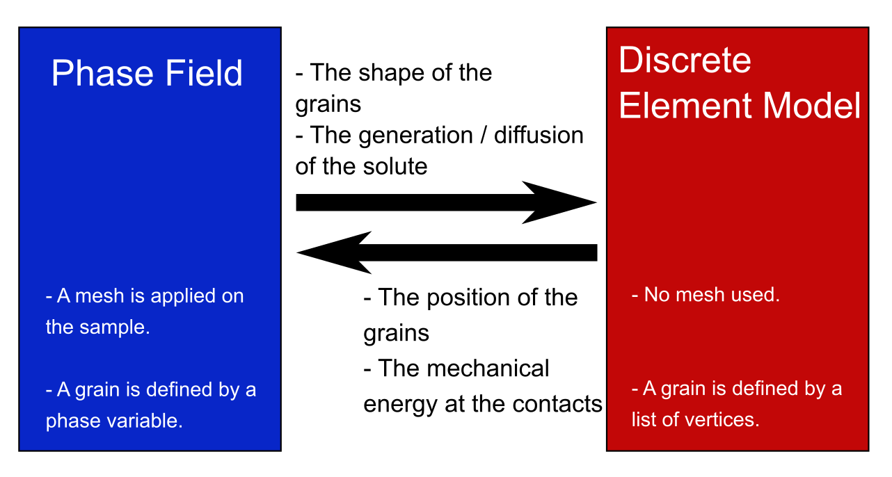
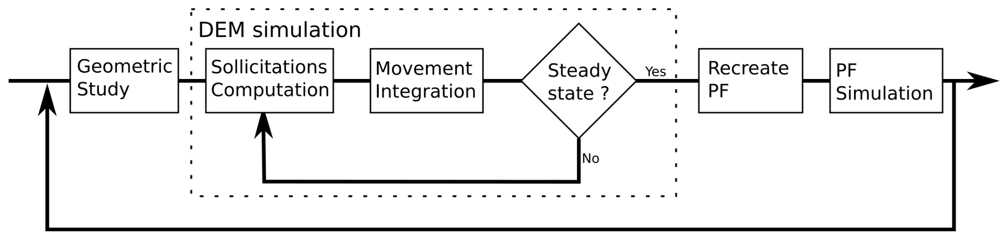

# PFDEM_AC

Phase-Field Discrete Element Modelisation applied to granular material.

## Simulation presentation
The goal is to reproduce result from <i>Shin, H., Santamarina, J.C. (2009) Mineral Dissolution and the Evolution of k0, Journal of Geotechnical and Geoenvironmental Engineering, 135, 1141-1147</i>.
This simulation is about a 2D test under oedometrical conditions with an acid injection to dissolve a fraction of the particles.

The chain force and the k0 (= &sigma;1/&sigma;2) evolves with the material dissolution. The influence of the shape of the dissolvable particles is discussed.

## Technical description
The PFDEM is a discussion between phase-field (PF) simulation and discrete element modelization (DEM). Even if those formulations are different, they can collaborate with data exchange.

The [phase-field theory](https://en.wikipedia.org/wiki/Phase-field_model) is based on the mesh of the sample and grains are represented by a phase variable (= 1 if the node is a grain, = 0 else). This formulation transmit to the DEM the shape of the grain. Hence, a grain detection algorithm is used to extract the shape from the phase field. In this case, no information about the solute is needed as it is assumed the solute is instantaneously evacuated.

The [discrete element model](https://en.wikipedia.org/wiki/Discrete_element_method) does not need mesh and grains are represented by a list of vertices (here polygonal grains are assumed). The role of the DEM is to compute the position of the grains. Then, an algorithm is used to convert the grain position in a new phase-field. The mechanical energy at the contact level is not considered as the acid is the motor term of the dissolution.

A back and forth is done between phase-field (PF) simulation and discrete element modelisation (DEM). Hence, once a steady-state is reached with the DEM, the phase-field theory is called. The shape of the grains will change and the steady state is not verified and must be computed by a new DEM step.
The following schemes illustrate the algorithm.

Phase-field approach is computed with [MOOSE](https://github.com/idaholab/moose) (the solver must be correctly installed) and DEM is computed with an own script based on python 3.9.6. The launch of this project is done by executing the python script <i>main.py</i> (multiple run can be asked with <i>multiple_main.py</i>). The user can change variables inside the python script <i>User.py</i>. A section in the following helps to understand the different inputs.

Saves are done before the phase-field simulation and at the end of the DEM. If crash (it seems to happend often during the phase-field simulation with MOOSE) occurs during the simulation, the function <i>main_after_crash.py</i> can be called to come back before the crash.

### Phase-field
The goal of the phase-field step is to compute the shape of the grains as it evolves with the dissolution.
An Allen-Cahn formulation is used. Hence, the conservation of the mass should not be verified as dissolution occurs.

### DEM
The goal of the DEM step is to compute a steady-state configuration. Grains are assumed as polygonal. The shape is computed from an interpolation of the phase variable. At the end of the step, interactions (grain-grain and grain-wall) are computed to highlight the evolution of the chain force and k0.

## What is next ?
Some next releases are presented here.

- find a way to multiproccess the DEM simulation
- add rolling resistance
- increase the user experience (homogenize names, correct english)
- create AI or a guide to select algorithm parameters (as neighborhood update frequency, time step, stop criteria, etc...)
- add some quick tests to check the script
- correct the functions P_is_inside() because if the coordinate y = the coordinate of the vertex, the point is considered outside (even  if it is not the case)
- publish an article about the simulation and result

## Understand User.py

Inputs are sorted in different dictionnaries.

#### Geometry

- <i>N_grain_disk</i> : is the number of the undissolvable grains. It is computed from the variables <i>N_grain</i> and <i>frac_dissolved</i>
- <i>R_mean</i> : is the mean radius of the undissolvable grains. It is computed from the particle size distribution used
- <i>L_R</i> : is the list of the radius. It defines the particle size distribution of the undissolvable grains with the variable <i>L_percentage_R</i>
- <i>L_percentage_R</i> : is the percentage of total number of undissolvable grains with a linked radius. It defines the particle size distribution of the undissolvable grains with the variable <i>L_R</i>
- <i>grain_discretisation</i> : is the discretization of the undissolvable grains
- <i>N_grain_square</i> : is the number of the dissolvable grains. It is computed from the variables <i>N_grain</i> and <i>frac_dissolved</i>
- <i>Dimension_mean</i> : is the mean dimension of the dissolvable grains. Following the shape of the dissolvable grains, the dimension can be different things (radius, lenght for example). It is computed from the particle size distribution used
- <i>L_Dimension</i> : is the list of the dimension. It defines the particle size distribution of the dissolvable grains with the variable <i>L_percentage_Dimension</i>
- <i>L_percentage_Dimension</i> : is the percentage of total number of dissolvable grains with a linked dimension. It defines the particle size distribution of the dissolvable grains with the variable <i>L_Dimension</i>
- <i>grain_discretisation_square</i> : is the discretization of the dissolvable grains

#### Material

- <i>Y</i> : the Young modulus
- <i>nu</i> : the Poisson ratio
- <i>rho</i> : the density of the grain, it defines the surface mass for dissolvable and undissolvable grains.
- <i>mu_friction_gg</i> : the friction coefficient for the contact grain-grain
- <i>mu_friction_gw</i> : the friction coefficient for the contact grain-wall
- <i>coeff_restitution</i> : the restitution coefficient (= 1 perfect elastic, = 0 perfect plastic)
- <i>M_pf</i> : The mobility of the phase variables
- <i>kc_pf</i> : the gradient coefficient for the phase variables

#### Sample

- <i>x_box_min</i> : the coordinate of the left wall
- <i>x_box_max</i> : the coordinate of the right wall
- <i>y_box_min</i> : the coordinate of the lower wall. The position of the upper wall is moving to verify the confinement pressure

#### Algorithm

- <i>dt_PF</i> : the time step used for the phase-field simulation
- <i>n_t_PF</i> : approximatively the time step of the phase-field simulation. It defines with <i>dt_PF</i> the total duration of the phase-field simulation
- <i>dx_local</i> and <i>dy_local</i> : define the mesh of the phase-field simulations.
- <i>dt_DEM</i> : the time step for the DEM simulation
- <i>i_DEM_stop</i> : the maximum iterations done during a DEM simulation
- <i>i_update_neighborhoods</i>: the frequency of neighborhood update
- <i>factor_neighborhood</i> : defines the size of the neighborhood
- <i>Spring_type</i> : model used during DEM simulation
- <i>Ecin_ratio</i> : defines a stop criteria for the DEM simulation. The steady-state is assumed when the mean displacement during one DEM step is lower than the ratio of the mean radius
- <i>n_window_stop</i> : defines a steps window to detect the steady state
- <i>dk0_stop</i> : in the window defined by <i>n_window_stop</i>, the steady-state is detected if the difference between the maximum and the minimum k0 (= &sigma;1/&sigma;2) is lower than <i>dk0_stop</i>
- <i>dy_box_max_stop</i> : in the window defined by <i>n_window_stop</i>, the steady-state is detected if the difference between the maximum and the minimum upper wall position is lower than <i>dy_box_max_stop</i>
- <i>n_t_PFDEM</i> : the total number of PFDEM iteration. A PFDEM iteration is composed by one DEM and one phase-field simulations.
- <i>MovePF_selector</i> : method to move the phase-field
- <i>np_proc</i> : number of processor used for the simulation

#### Initial condition

- <i>n_generation</i> : number of grain generation
- <i>N_test_max</i> : the maximum number of try to generate a grain without overlap with grains already created
- <i>factor_ymax_box</i> : define the upper wall position for the grain generation
- <i>i_update_neighborhoods_gen</i>: frequency of neighborhood update during one generation step.
- <i>i_update_neighborhoods_com</i>: frequency of neighborhood update during multi generation step.
- <i>factor_neighborhood_IC</i> : defines the size of the neighborhood
- <i>i_DEM_stop_IC</i> : the maximum DEM iterations
- <i>dt_DEM_IC</i> : the DEM time step
- <i>Ecin_ratio_IC</i> : defines a stop criteria for the DEM simulation. The steady-state is assumed when the mean displacement during one DEM step is lower than the ratio of the mean radius

#### Sollicitations

- <i>Dissolution_Energy</i> : the dissolution energy introduced in the phase-field simulations
- <i>Vertical_Confinement_Force</i> : the vertical confinement force applied on the upper wall
- <i>gravity</i> : value of the gravity
