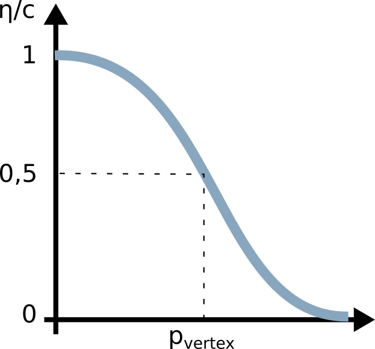

# Couplings documentation

## From PF to DEM

The vertices coordinates are determined by interpolation of the phase-field. As shown by the following scheme, a vertex is assumed when the variable reaches the value 0,5.

## From DEM to PF

Description in coming...
