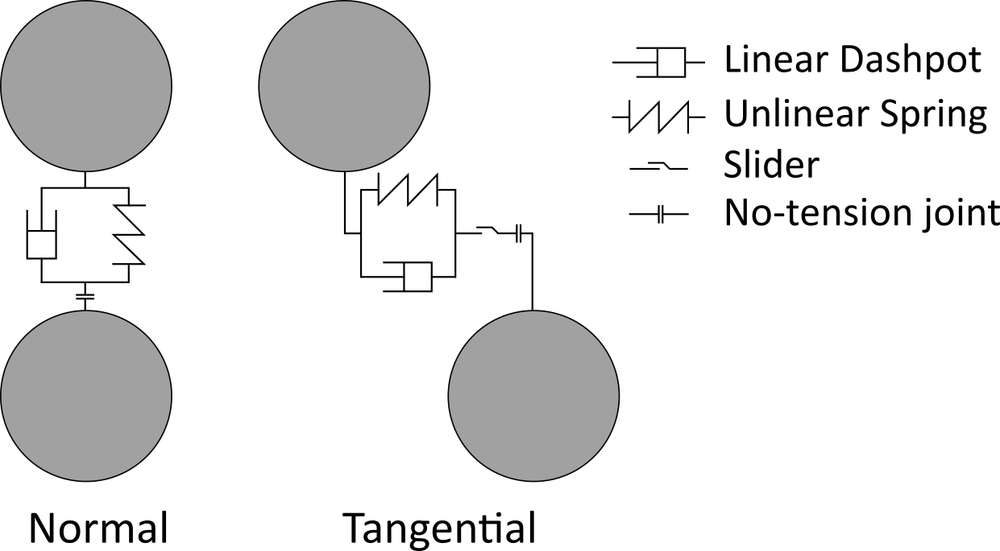

# DEM documentation

## What is a grain ?

A grain is a polygonal particle defined initially by the coordinates of the vertices and some material proprieties (Young modulus, Poisson's ratio, surface mass). By apllying a [Monte Carlo method](https://en.wikipedia.org/wiki/Monte_Carlo_method), the mass, the center of the mass and the inertia of the grain is determined.
A grain can know two kinds of interaction a grain-grain one or a grain-wall one.

## Grain - grain interaction

The contact between two particles is determined by apllying the method developped by <i>Nezami et al.</i>.

Once the contact is determined, Hertz laws illustrated by the following scheme are applied to the contact.

### Normal behavior

Some equivalent parameters must be defined :
  - an Young modulus 1/Yeq = (1-&nu;2i)/Yi + (1-&nu;2j)/Yj
  - a radius 1/Req = 1/Ri + 1/Rj  
  - a mass meq = (mi&times;mj) / (mi+mj)

About the spring term :
  The value of the spring is k = 4/3&times; Yeq&radic;(Req).
  An Hertz law is applied, considering an unlinear spring : Fsn = -k&times;overlapn3/2

About the damping term :
  The value of the dashpot is &eta; = 2 &times; &gamma; &radic;(meq&times;k)
  with &gamma; = -ln(e)/&radic;(&pi;2+ln(e)2)
  e the restitution coefficient of the contact
  An Hertz law is applied, considering a linear damping : Fdn = -&eta;&times;(vi-vj).n

### Tangential behavior

Some equivalent parameters must be defined :
  - a shear modulus 1/Geq = (1-&nu;i)/Gi + (1-&nu;j)/Gj
    with Gi = Yi/(2(1+&nu;i))

About the spring term :
  The value of the unlinear spring is kt = kt0&radic;(1-(2&times;kt0&times;overlapt)/(3&times;&mu;Fsn))
  with kt0 = 8&times;Geq&radic;(Reqoverlapn)
  An incremental Hertz law is applied, considering an unlinear spring : Fstt = Fstt-1 - kt&times;&Delta;overlapt
  with &Delta;overlapt = (vi-vj).t &times; dt
  An Coulomb criteria is considering to add sliding : Fstt &le; &mu; Fstn

About the damping term :
  The value of the dashpot is &eta; = 2 &times; &gamma; &radic;(meq&times;kt)
  with &gamma; = -ln(e)/&radic;(&pi;2+ln(e)2)
  e the restitution coefficient of the contact
  An Hertz law is applied, considering a linear damping : Fdt = -&eta;&times;(vi-vj).t

### Rolling behavior

The rolling behavior is not defined for the moment (release in coming...).

## Grain - wall interaction

The contact detection is done with the coordinate of the extremum vertex of the grain :
  - minimum of the coordinate x < coordinate of the left wall -> contact with the left wall
  - maximum of the coordinate x > coordinate of the right wall -> contact with the right wall
  - minimum of the coordinate y < coordinate of the lower wall -> contact with the lower wall
  - maximum of the coordinate y > coordinate of the upper wall -> contact with the upper wall

The compute of the reaction is the same as grain - grain interaction except the following :
  - Yeq = Y/(1-&nu;2)
  - Req = R
  - meq = m
  - k = factor&times;4/3&times; Yeq&radic;(Req) (factor is here to increase the stiffness)
  - there is not a normal damping term for the upper wall
  - there are not tangential damping terms for all walls

## Time integration

The Symplectic Euler method is used.

For the translation due to forces:
at-1 = &Sigma;Ft-1/m
vt = vt-1 + at-1 &times; dt
pt = pt-1 + vt-1 &times; dt

For the rotation due to moments:
d&omega;/dtt-1 = &Sigma;Mt-1/I
&omega;t = &omega;t-1 + d&omega;/dtt-1 &times; dt
&theta;t = &theta;t-1 + &omega;t-1 &times; dt
pt = Prot pttempo + centert
Prot is a rotation matrix with the angle &omega;&times;dt
pttempo = pt - centert

## References

E. Nezami, Y. Hashash, Zhao D., Ghaboussi J., A fast contact detection algorithm for 3-D discrete element method (2004) Computers and Geotechnics, Vol. 31, Pages 575-587, DOI : 10.1016/j.compgeo.2004.08.002

C. O'Sullivan, Particulate Discrete Element Modelling (2011) DOI : 10.1201/9781482266498
